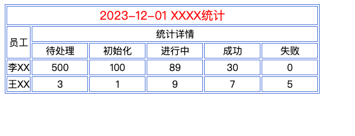

收到需求，每天要从数据库统计相关报表，生成html table发到相关人的邮箱。   
第一版写的面向过程的代码，数据和html代码混在一起，要做改动很难。 搜了一下看有没有现成的类库，没找到合适的table生成类。就自己写了一个简单的


### 目标：创建如下table
```html
<table>
    <tr >
        <td colspan='6' class='red font-size-20'>2023-12-01 XXXX统计</td>
    </tr>
    <tr >
        <td rowspan='2'  >员工</td>
        <td colspan='5' >统计详情</td>
    </tr>
    <tr >
        <td class='width_90'>待处理</td>
        <td class='width_90'>初始化</td>
        <td class='width_90'>进行中</td>
        <td class='width_90'>成功</td>
        <td class='width_90'>失败</td>
    </tr>
    <tr >
        <td>李XX</td>
        <td>500</td>
        <td>100</td>
        <td>89</td
        ><td>30</td>
        <td>0</td>
    </tr>
    <tr >
        <td>王XX</td>
        <td>3</td>
        <td>1</td>
        <td>9</td>
        <td>7</td>
        <td>5</td>
    </tr>
</table>
```



### 使用示例
见main.php